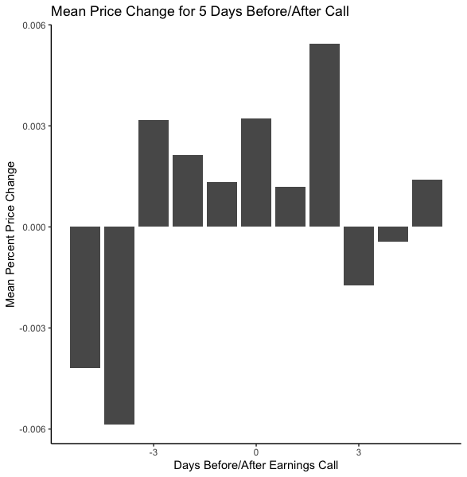
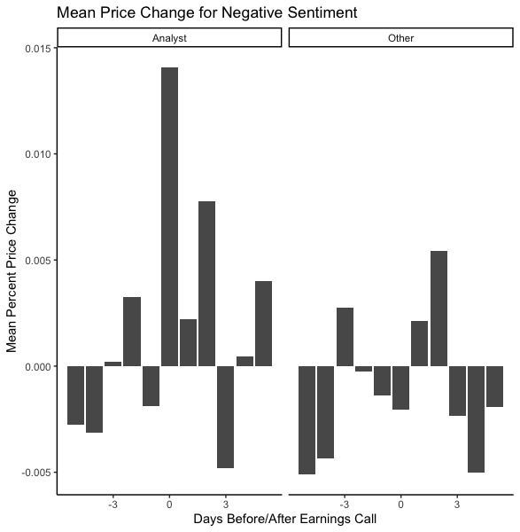

# Earning-Call-Analysis
Analyzes earning calls and stock prices. Uses NLP, Sentiment Analysis, ggplot2, and interacts with alpha vantage API

### Libraries Used in This Project:

```r
library(dplyr)
library(ggplot2)
library(stringr)
library(lexicon)
library(tm)
library(sentimentr)
library(tidyr)
library(zoo)
library(MASS)
library(lme4)
```

### Data:

The data used in this project were individual transcripts from WEE earning calls provided by Seth Berry. Some of the files were parased and some were unparased. In addition, onbtained stock market data from "https://www.alphavantage.co/documentation/" for five trading days before the earnings call and five days after the earnings call. 

To import the data, first, I set the name of the folder I wanted to unzip, "wweCalls.zip" equal to the object named setwd. Next, I used the function unzip to unzip the file.

```r
setwd <- "wweCalls.zip"
unzip(setwd, exdir = "Unzipped Data/")
```

Next, I created an object named temp with the function list.files to get all of the names of the files within the folder "Predictive Analytics Homework 1" that followed the pattern of "wwe_parsed_(.*)" in their file names. After creating this list of characters, I then used lapply with read.csv to get all of the files into my environment. After doing this I used do.call to rbind all of the data frames because they were stored within a giant list of data frames.

```r
temp <- list.files(path = "/Users/joeyj/Desktop/Desktop/2020/Notre Dame/Quarter 3/Unstructured Data Analytics/Predictive Analytics Homework 1/", 
           pattern = "wwe_parsed_(.*)",
           full.names = FALSE)
csv <- lapply(temp, read.csv)
wwe <- do.call(rbind, csv)
```

### Data Exploration:

After getting the data into my environment, I then created a plot to explore the data. 

```r
str(wwe)
table(wwe$likelyRace)
ggplot(wwe, aes(x=likelyRace)) +
  geom_bar() + 
  theme_classic() +
  labs(title="Likley Race", x = "Likely Race", y = "Count")
```


After looking at the initial data structure of the data, a few things stand out:

 - the ticker is a factor with only one level. This is what we expected
  
 - the date is a factor with 33 levels. Also, what we expected to see because there are 33 CSV files
  
 - the quarter is a factor with four levels. Again, this is what we expected because there are four quarters in a year.
 
 - The likely race column is predominately classified as "meanwhite," thus, I do not know how much value this variable will add to the analysis.

After reviewing the data, I believe that the main emphasis of data cleaning should be centered around the text. While there are no missing values, there are columns with text that only responses to what someone said. Due to this, I decided to remove entries that have comments such as "Thank you." or "Okay. Thank you." However, before I did this, I decided to use McDonald's stop word lists. In my analysis, I am going to remove words with his lists "StopWords_Names" and "StopWords_GenericLong." I also decided to remove comments and instances that involved the operator because I did not see the value that there comments added. 

```r
wwe2 <- wwe
wwe2$text <- str_squish(wwe2$text)
wwe2$name <- str_squish(wwe2$name)

wwe2 <- wwe2 %>% 
  filter(name !="operator")
```

#### Cleaning Data:

```r
wwe2 <- wwe2 %>% 
  filter(text != "Okay.") %>% 
  filter(text != "Okay. Thank you.") %>% 
  filter(text != "Okay, thank you.") %>% 
  filter(text != "Okay. Great. Thank you.") %>% 
  filter(text != "Thank you.") %>% 
  filter(text != "Okay thank you.") %>% 
  filter(text != "Good morning.") %>% 
  filter(text != "Uh-huh.") %>% 
  filter(text != "Thanks, very much.") %>% 
  filter(text != "Thank you very much.") %>% 
  filter(text != "Thank you. Operator, next question?") %>% 
  filter(text != "Okay, very fair. Thank you very much.") %>% 
  filter(text!= "	Okay, great. Thank you.") %>% 
  filter(text != "Good. Thank you.") %>% 
  filter(text != "Thank you all") %>% 
  filter(text != "Thank you for your question.") %>% 
  filter(text != "Okay, great. Thank you.") %>% 
  filter(text != "Thank you all.") %>% 
  filter(text != "Yes, thank you.") %>% 
  filter(text != "Okay. Thank you. Next question, operator?") %>% 
  filter(text != "Okay great thank you.") %>% 
  filter(text != "All right. Thank you.") %>% 
  filter(text != "Great. Thank you.") %>% 
  filter(text != "Great. Thank you, guys. Good luck.") %>% 
  filter(text != "Sure. Thank you.") %>% 
  filter(text != "Right. Okay. Thank you.") %>% 
  filter(text != "Right. Okay. Thank you.") %>% 
  filter(text != "Thank you, guys.") %>% 
  filter(text != "Thank you. Good morning.") %>% 
  filter(text != "Perfect. Thank you.") %>% 
  filter(text != "All right. Thank you very much.") %>% 
  filter(text != "Okay great. That's all I have. Thank you.") %>% 
  filter(text != "Okay, great. Thank you so much.") %>% 
  filter(text != "Thank you everyone.") %>% 
  filter(text != "All right, sounds good. Thank you.") %>% 
  filter(text != "Okay. All right, thank you.") %>% 
  filter(text != "Okay, great. Thank you very much.") %>% 
  filter(text != "Okay, thank you very much.") %>% 
  filter(text != "Okay that's it, thank you guys very much.") %>% 
  filter(text != "Great. Thank you, guys.") %>% 
  filter(text != "Thank you. Have a good day.") %>% 
  filter(!str_detect(text, "^Okay\\.(.*) very much\\.$")) %>% 
  filter(!str_detect(text, "Great(.*) much\\.$")) %>% 
  filter(!str_detect(text, "^Okay(.*) guys\\.$")) %>% 
  filter(!str_detect(text, "^Okay,(.*) Thanks very much\\.$")) %>% 
  filter(!str_detect(text, "^Okay(.*) thanks\\.$")) %>% 
  filter(!str_detect(text, "^Got(.*)\\.$")) %>% 
  filter(!str_detect(text, "^Thank(.*) guys\\.$")) %>% 
  filter(!str_detect(text, "^Definitely(.*) you\\.$")) %>% 
  filter(!str_detect(text, "^Okay(.*) thank you\\.")) 
wwe2$title <- str_squish(wwe2$title)
wwe2 <- wwe2 %>% 
  filter(title != "- I think it was -- it's Taj, it used to be Taj, but it's -- is the network. They are -- I think it is our second or third highest paid television deal. They run our programming all the time.")
```

After Analyzing the data, I decided to group the job titles into three bins (Exec, Analyst, and Other). The plot shows that the executives are the ones with most comments. This makes sense on an earnings call because typically, they are the ones who talk the most.

```r
wwe2 <- mutate(wwe2, category = 
          ifelse(grepl(".*CEO.*", wwe2$title), "Exec",
          ifelse(grepl(".*CFO.*", wwe2$title), "Exec",
          ifelse(grepl("Analyst", wwe2$title), "Analyst",
          ifelse(grepl(".*Director.*", wwe2$title), "Exec", 
          ifelse(grepl(".*Chief.*", wwe2$title), "Exec",
          ifelse(grepl(".*COO.*", wwe2$title), "Exec",
          ifelse(grepl(".*Chairman.*", wwe2$title), "Exec", "Other"))))))))
```

### Visualizations:

```r
ggplot(wwe2, aes(x=category)) +
  geom_bar() + 
  theme_classic() +
  labs(title="Title", x = "Job Title", y = "Count")
```


### Text Analysis:

```r
wwe2$date <- as.Date(wwe2$date, format = "%d-%b-%y")
wwe2$date <- format(wwe2$date, "%Y-%m-%d")
wwe2$category <- as.factor(wwe2$category)
wwe2_sentiment <- sentiment(get_sentences(wwe2),
          polarity_dt = lexicon::hash_sentiment_loughran_mcdonald) %>% 
  group_by(date, category) %>% 
  summarize(meanSentiment = mean(sentiment))
wwe2_sentiment
wwe2_category_sentiment <- sentiment(get_sentences(wwe2),
          polarity_dt = lexicon::hash_sentiment_loughran_mcdonald) %>% 
  group_by(category) %>% 
  summarize(meanSentiment = mean(sentiment))
wwe2_category_sentiment
```

I elected to use Loughran and Mcdonald lexicon for sentiment analysis because it was made to analyze financial reports and earnings calls.

After running my sentiment analysis, I decided to create a plot that analyzed the mean sentiment values for each title category. 

```r
wwe2_sentiment %>% 
  group_by(category) %>% 
  summarise(Mean = mean(meanSentiment)) %>% 
  ggplot(., aes(x = category, y = Mean)) +
  geom_bar(stat="identity") +
  theme_classic() + 
  labs(title = "Mean Sentiment vs. Title Category",
       xlabs = "Category", ylabs="Mean Sentiment")
```


Based on initial analysis, Executives are often very positive about the company. This makes sense. Typically, executives are very positive about their companies. In addition, the analysts have a slightly lower mean sentiment, but it is still positive. Again this makes sense because typically Analysts who appear on earnings calls actively follow the company and thus may be excited about the company. Finally, the category other is negative. Again, this is not surprising because that category is filled with people who are part of the media, vice presidents, and other members of the company. Thus these individuals typically appear on earnings calls when something bad happened. However, I was curious, so I decided to facet wrap the next plot to view the sentiment for each call.

```r
ggplot(wwe2_sentiment, aes(x=category, y = meanSentiment)) +
  geom_bar(stat="identity") +
  facet_wrap(~date) +
  theme_classic() +
  labs(title = "Mean Sentiment vs. Title Category Grouped by Call Date",
       x="Title Category", 
       y="Mean Sentiment")
```


When you look at these plots, a few things stand out. One, executives always have a positive sentiment value. This makes sense because, as mentioned above, executives are generally extremely positive about their companies because they hope to have a positive influence on Analysts and those listening on the call and thus drive the price higher. Next, analysts and the category others have fluctuating sentiment values. This makes sense because both categories react to the performance of the company. If the company did something, positive analysts would be optimistic. On the flip side, if the company did something negative, analysts will be pessimistic. The same can be said for the category "Other." If the company or a division in the company did something positive, the media and other members of the company would be positive. However, if the company or division in the company did something negative, the media and junior members of the company will be negative.

### Obtaining Stock Data from alphavantage:

I used python because pandas are very good at handling dates. First, I interacted with the alpha vantage to obtain stock data for WWE. In addition, I decided to take all of the data available. Part of the reason I did this was because I did not know what dates I was going to need yet. At this time, I was unsure what type of analysis I was going to run, so I also created various columns such as "Volume_Pct_Change" and "Close_Pct_Change."

After getting the data, I cleaned the data frame and eliminated columns that were not necessary for my analysis. After doing this, I created a nested for loop to get the necessary dates. The first for loop runs through a list that contains the date of the earning call. The second for loop gets the five dates before the earnings call date, the earnings call date, and the date after the earnings call. After doing this, I merged the dates with the stock data.

```python
import pandas as pd
import requests
import numpy as np
from datetime import timedelta
from pandas.tseries.holiday import USFederalHolidayCalendar
from pandas.tseries.offsets import CustomBusinessDay

key = '1KW48T75I9DWOZ9Y'
api_url = 'https://www.alphavantage.co/query?'

data = {
    'function': 'TIME_SERIES_DAILY',
    'symbol': 'WWE',
    'outputsize': 'full',
    'datatype': 'json',
    'apikey': key
}
test = requests.get(api_url, params=data)
test_json = test.json()
data = pd.DataFrame.from_dict(test_json['Time Series (Daily)'], orient='index').sort_index(axis=1)
data = data.rename(columns={ '4. close': 'Close', '5. volume': 'Volume'})

data2 = data[['Close', 'Volume']]
data2.reset_index(inplace = True)
data2 = data2.rename(columns={'index':'date'})
data2['date'] = pd.to_datetime(data2['date']).dt.normalize()
data2['Close'] = data2.Close.astype(float)
data2['Volume'] = data2.Volume.astype(float)
data2.sort_values("date", inplace = True)
data2['Close_Pct_Change'] = data2.Close.pct_change()
data2['Volume_Pct_Change'] = data2.Volume.pct_change()
data2['Volume_Log'] = np.log(data2.Volume)
data2['Close_Log'] = np.log(data2.Close)

dates2 = dates.reset_index()
dates2 = dates2[['date', 'ticker']]
dates2['date'] = pd.to_datetime(dates2['date']).dt.normalize()

us_bd = CustomBusinessDay(calendar=USFederalHolidayCalendar())
new_dates = []
for x in range(0, 32):
    original_date = dates2['date'].iloc[x]
    start_date = original_date - CustomBusinessDay(n=5, calendar = USFederalHolidayCalendar())
    l = []
        index = []
    for j in range(-5, 6):
        index.append(j)
    for i in range(0,11):
        l.append(original_date)
    date_range = pd.bdate_range(start = start_date, periods = 11, freq = us_bd)
    date_dict = {'date': date_range, 'original_date':l}
    date_table = pd.DataFrame(date_dict)
    new_dates.append(date_table)
search_dates = pd.concat(new_dates)

dates_close = pd.merge(search_dates, data2, on ='date', how='inner')

path='/Users/joeyj/Desktop/Desktop/2020/Notre Dame/Quarter 3/Unstructured Data Analytics/'
dates_close.to_csv(path+'assignment1_dates_close.csv', index=False)
```

After obtaining stock data, I decided to analyze the impact of a calls sentimnet on trading based on the days before and after the call. 

```r
# Reading stock prices in
stock_prices <- read.csv("assignment1_dates_close.csv")
stock_prices$date <- str_squish(stock_prices$date)
stock_prices$original_date <- str_squish(stock_prices$original_date)
stock_prices$original_date <- as.Date(stock_prices$original_date)
stock_prices$date <- as.Date(stock_prices$date)
wwe2_sentiment$date <- as.Date(wwe2_sentiment$date)
stock_sentiment <- merge(x =wwe2_sentiment, y = stock_prices, by.x = "date", by.y = "original_date")
stock_sentiment$sentiment_positive_negative <- ifelse(stock_sentiment$meanSentiment >0, 1, 0)
```

The graphs below a grouped by category, index, and a binary variable (sentiment_positive_negative) which takes a value of 1 when the call is positive and 0 when the call is negative. 

```r
group_sentiment <- stock_sentiment %>% 
  group_by(category, index, sentiment_positive_negative) %>% 
  summarise(Close_Mean_Pct = mean(Close_Pct_Change))

group_sentiment2 <- stock_sentiment %>% 
  group_by(index) %>% 
  summarise(Close_Mean_Pct = mean(Close_Pct_Change))

ggplot(group_sentiment2, aes(y = Close_Mean_Pct, x = index)) + 
  geom_bar(position="dodge", stat="identity") +
  theme_classic() +
  labs(title = "Mean Price Change for 5 Days Before/After Call",
       x="Days Before Earnings Call",
       y="Mean Percent Price Change")
```



```r
group_sentiment %>% 
  filter(sentiment_positive_negative == 0) %>% 
  ggplot(., aes(y = Close_Mean_Pct, x = index)) + 
  facet_wrap(~category) +
  geom_bar(position="dodge", stat="identity") +
  labs(title = "Mean Price Change for Negative Sentiment")
```



```r
group_sentiment %>% 
  filter(sentiment_positive_negative == 1) %>% 
  ggplot(., aes(y = Close_Mean_Pct, x = index)) + 
  facet_wrap(~category) +
  geom_bar(position="dodge", stat="identity") +
  labs(title = "Mean Price Change for Positive Sentiment")
```


After creating the plots, a few trends stand out. The first plot shows the average percentage change five days before the call and five days after the call. From this plot, it seems that there is an opportunity if you buy the stock at the closing time four days before the call and then sell the call two days after the call. However, other graphs provide more information.  

A surprising trend appeared in the negative sentiment graph. When analysts were negative, stocks increased in price, the day of the earnings call, and the following two days. However, the same cannot be said for the category other. This graph does not seem to follow a trend. Finally, when the earnings call has a positive sentiment, it appears that the price of the stock increases in the days following the call. 

### Parsing unparsed Data:

First, I read the data into my global environment.

```r
raw_27_oct_16 <- read.csv("wwe_raw_27_Oct_16.csv", stringsAsFactors = FALSE)
raw_28_jul_16 <- read.csv("wwe_raw_28_Jul_16.csv", stringsAsFactors = FALSE)
```

### People Function

Next, I created a people function that does the majority of formating so the columns are similar to the files in section bronze and silver.

```r
createPeople <- function(table, ticker, date, quarter) {
  table$Name = str_squish(table$Name)
  table$name = tolower(table$Name)
  table$firstName = gsub(" .*$", "", table$Name)
  table$firstLast = tolower(table$Name)
  table$ticker = ticker
  table$date = as.Date(as.character(date), format = "%d-%b-%y")
  table$quarter = quarter
  return(table)
}
```

### October 27 2016 People

After importing the data, I analyzed the transcript and deterimed parts that I needed to pull out to perform my analysis.

```r
executives <- data.frame(name = raw_27_oct_16[5:7,])
executives <- separate(executives, name, c("Name", "title"), sep = "\\\x96", remove = TRUE)
executives$organization = "	World Wrestling EntertainmentInc."
analysts <- data.frame(name = raw_27_oct_16[9:14,])
analysts <- separate(analysts, name, c("Name", "organization"), sep = "\\\x96", remove = TRUE)
analysts$title <- "Analyst"
operator <- data.frame(Name ="Operator", title = NA, organization= NA)
oct_27_16_people <- rbind(executives, analysts, operator)
oct_27_16_people <- createPeople(oct_27_16_people, "WWE", "27-Oct-16", "Q3")
```

### July 28 2016 People

The operator's information will be the same as before, so there is no need to create a new operator data frame. However, the executives and analysts might have changed, so I grabbed them from the transcript.

```r
executives_7_16 <- data.frame(name = raw_28_jul_16[5:7,])
executives_7_16 <- separate(executives_7_16, name, c("Name", "title"), sep = "-", remove = TRUE)
executives_7_16$organization = "	World Wrestling EntertainmentInc."
analysts_7_16 <- data.frame(name = raw_28_jul_16[9:14,])
analysts_7_16 <- separate(analysts_7_16, name, c("Name", "organization"), sep = "-", remove = TRUE)
analysts_7_16$title <- "Analyst"
jul_16_people <- rbind(executives_7_16, analysts_7_16, operator)
jul_16_people <- createPeople(jul_16_people, "WWE", "16-Jul-16", "Q2")
```

### Deparsing Function 

I created a function that formats the table to be the same as the tables in bronze and silver. It matches the tables by indexing multiple times. I used an anti join to remove the text of the person's name before they begin to appear on the transcript. In addition, I merged text together if the speaker on the row was consecutive to the previous row.

```r
get <- function(table1, table2) {
  table1$info = str_squish(table1$info)
  table1$index = seq.int(nrow(table1))
  new_table = merge(table1, table2, by.x="info", by.y="Name")
  new_table = new_table[order(new_table$index),]
  new_table$names_index = seq.int(nrow(new_table))
  table3 = merge(new_table, table1, by.x="index", by.y = "index", all=TRUE)
  table3$names_index = na.locf(table3$names_index, fromLast = FALSE)
  table3 = table3[,c(1, 11, 12)]
  table4 = anti_join(table3, new_table, by = "index")[,-1]
  table4 = aggregate(info.y ~ names_index, data = table4, FUN = paste, collapse = "")
  table5 = merge(new_table, table4, by.x="names_index", by.y= "names_index")
  table5 = table5[, -c(1, 3)]
  table5 <- table5[c("name", "firstName", "firstLast", "title", "organization", "firstLast", "organization", "title", "info.y", "ticker", "date", "quarter")]
  table5 = rename(table5, "text" = "info.y")
  table5$text = str_replace_all(table5$text, "\x94", "'")
  return(table5)
}
```

### Create October 27 2016

I ran the function on October 27 2016.

```r
oct_27_16 <- data.frame(info = raw_27_oct_16[15:175,])
oct_27_16_text <- get(oct_27_16, oct_27_16_people)
```

### Create July 16 2016

Next, I ran the function on July 16 2016

```r
jul_16_16 <- data.frame(info = raw_28_jul_16[15:137,])
jul_16_16_text <- get(jul_16_16, jul_16_people)
```

### Combining the Two Days

After I unparsed the two transcripts, I decided to combine the two dates. After I did this, I added the column categories, the same way I did it in silver, and then took the sentiment of each text.

```r
text_combined <- rbind(oct_27_16_text, jul_16_16_text)
text_combined <- mutate(text_combined, category = 
          ifelse(grepl(".*CEO.*", text_combined$title), "Exec",
          ifelse(grepl(".*CFO.*", text_combined$title), "Exec",
          ifelse(grepl("Analyst", text_combined$title), "Analyst",
          ifelse(grepl(".*Director.*", text_combined$title), "Exec", 
          ifelse(grepl(".*Chief.*", text_combined$title), "Exec",
          ifelse(grepl(".*COO.*", text_combined$title), "Exec",
          ifelse(grepl(".*Chairman.*", text_combined$title), "Exec", "Other"))))))))
text_combined$category <- as.factor(text_combined$category)  

sentiment_jul_16_oct_27 <- sentiment(get_sentences(text_combined),
                            polarity_dt = lexicon::hash_sentiment_loughran_mcdonald) %>% 
  group_by(date, category) %>% 
  summarize(meanSentiment = mean(sentiment))
```

### Getting Stock Data in Python

I followed the same process I used above to obtain stock data in Python. 

```python
gold_data = {'date':['2016-07-16', '2016-10-27'], 
            'ticker': ['WWE', 'WWE']}
dates_gold = pd.DataFrame(gold_data)
dates_gold['date'] = pd.to_datetime(dates_gold['date']).dt.normalize()
new_dates = []
for x in range(0, 2):
    original_date = dates_gold['date'].iloc[x]
    start_date = original_date - CustomBusinessDay(n=5, calendar = USFederalHolidayCalendar())
    l = []
    index = []
    for j in range(-5, 6):
        index.append(j)
    for i in range(0,11):
        l.append(original_date)
    date_range = pd.bdate_range(start = start_date, periods = 11, freq = us_bd)
    date_dict = {'date': date_range, 'original_date':l, 'index':index}
    date_table = pd.DataFrame(date_dict)
    new_dates.append(date_table)
gold_search = pd.concat(new_dates)
gold_close = pd.merge(gold_search, data2, on='date', how='inner')
path='/Users/joeyj/Desktop/Desktop/2020/Notre Dame/Quarter 3/Unstructured Data Analytics/'
gold_close.to_csv(path+'assignment1_gold_dates_close.csv', index=False)
```

### Analysis

After getting the stock data, I combined the two transcripts and ran sentiment analysis. After this, I merged the table text_combined with stock_jul_oct_27.

```r
stock_jul_16_oct_27 <- read.csv("assignment1_gold_dates_close.csv", stringsAsFactors = FALSE)
stock_jul_16_oct_27$date <- str_squish(stock_jul_16_oct_27$date)
stock_jul_16_oct_27$original_date <- str_squish(stock_jul_16_oct_27$original_date)
stock_jul_16_oct_27$original_date <- as.Date(stock_jul_16_oct_27$original_date)
stock_jul_16_oct_27$date <- as.Date(stock_jul_16_oct_27$date)
stock_sentiment_jul_16_oct_27 <- merge(x = sentiment_jul_16_oct_27, y = stock_jul_16_oct_27, 
                                       by.x = "date", by.y = "original_date")
stock_sentiment_jul_16_oct_27$sentiment_positive_negative <- ifelse(stock_sentiment_jul_16_oct_27$meanSentiment >0, 1, 0)
```

After I merge the tables, I then grouped the data, in the same manner, I did in part silver and plotted the results.

```r
all_stock <- rbind(stock_sentiment, stock_sentiment_jul_16_oct_27)
all_stock_group_sentiment <- all_stock %>% 
  group_by(category, index, sentiment_positive_negative) %>% 
  summarise(Close_Mean_Pct = mean(Close_Pct_Change))

all_stock_group_sentiment2 <- all_stock %>% 
  group_by(index) %>% 
  summarise(Close_Mean_Pct = mean(Close_Pct_Change))
```

### Visualizations:

```r
ggplot(all_stock_group_sentiment2, aes(y = Close_Mean_Pct, x = index)) + 
  geom_bar(position="dodge", stat="identity") +
  theme_classic() +
  labs(title = "Mean Price Change for 5 Days Before/After",
       x="Days Before Earnings Call",
       y="Mean Percent Price Change")
```


```r
all_stock_group_sentiment %>% 
  filter(sentiment_positive_negative == 0) %>% 
  ggplot(., aes(y = Close_Mean_Pct, x = index)) + 
  facet_wrap(~category) +
  geom_bar(position="dodge", stat="identity") +
  theme_classic()+
  labs(title = "Negative Sentiment",
       x="Days Before/After Earnings Call",
       y="Mean Percent Price Change")
```


```r
all_stock_group_sentiment %>% 
  filter(sentiment_positive_negative == 1) %>% 
  ggplot(., aes(y = Close_Mean_Pct, x = index)) + 
  facet_wrap(~category) +
  theme_classic() +
  geom_bar(position="dodge", stat="identity") +
  labs(title = "Positive Sentiment",
       x="Days Before/After Earnings Call",
       y="Mean Percent Price Chnage")
```


The results above show that adding the two new dates does not change the results significantly. While the bars change slightly, on the whole, the graphs look very similar to the ones in silver.


